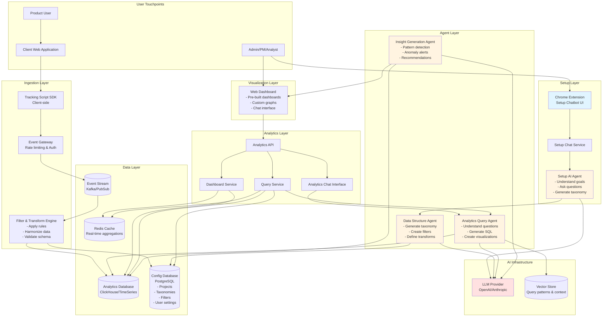
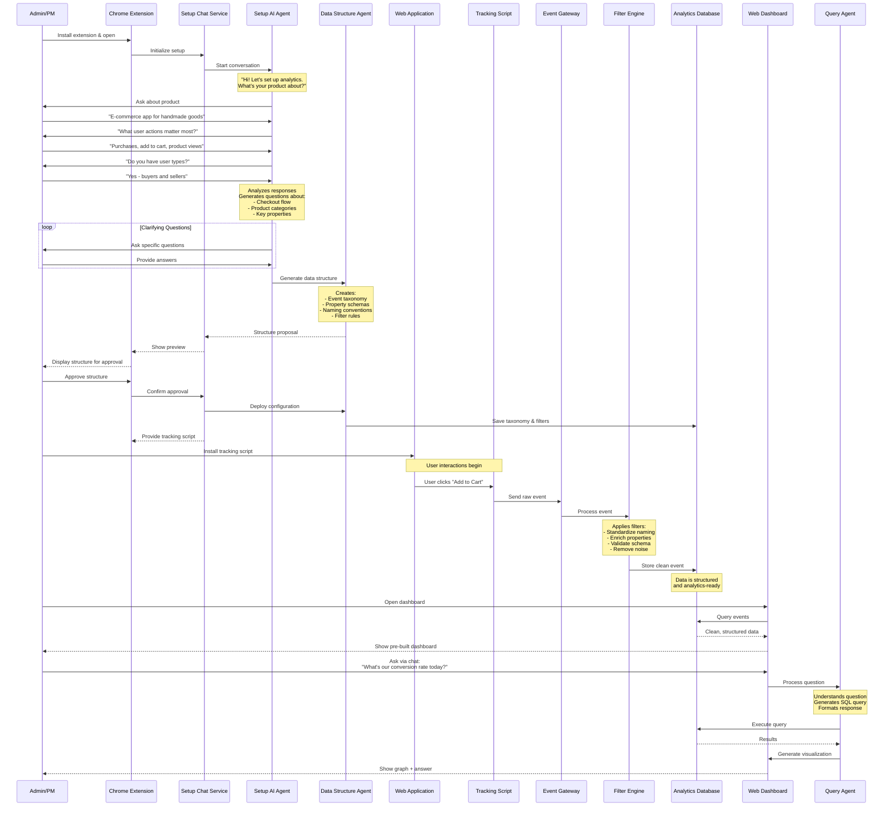

# Architecture Diagram - BetterHeap (MVP)

## Product Overview

### What is it?
An AI-powered web analytics platform that combines the ease of Heap's auto-tracking with intelligent data structuring through conversational AI. Unlike traditional analytics tools where data becomes messy and hard to query, BetterHeap uses an AI chatbot (via Chrome extension) to guide users through setup, understand their tracking needs, and automatically create clean, harmonized data structures that are ready to analyze.

### Business Value
**Problem**: Current web analytics tools like Heap and Mixpanel are either too complex to set up or produce messy, unstructured data. Heap auto-captures everything but the data becomes chaotic and hard to query. Mixpanel requires extensive manual setup and technical knowledge. Companies spend weeks configuring analytics, cleaning data, and still struggle to get meaningful insights because their event data is inconsistent.

**The Data Quality Gap**: Teams implement analytics quickly but realize months later that their data is unusable - inconsistent naming conventions, missing properties, duplicate events, and no clear taxonomy. This forces expensive data cleanup projects and rebuilding dashboards.

**Solution**: An analytics platform that combines automatic tracking with AI-guided data structuring. Our Chrome extension chatbot walks users through setup, understands their business goals, asks intelligent questions about what they want to track, and automatically creates a clean, harmonized data structure with filters and transformations applied at ingestion. The result: analytics-ready data from day one, with an AI assistant that helps query and visualize insights.

**Target Market**: Fast-growing startups and scale-ups (10-200 employees) who need powerful analytics but lack dedicated data engineers or extensive technical resources.

**Key Benefits**:
- **10-minute setup** - Chrome extension + conversational setup (vs. weeks of configuration)
- **Clean data from day one** - AI-structured taxonomy and automatic harmonization
- **No data engineering required** - filters and transformations handled automatically
- **Natural language queries** - ask questions, get insights without learning complex tools
- **Plug-and-play dashboards** - pre-built for common use cases
- **Cost-effective** - simpler infrastructure, faster time-to-value

### How It Works

1. **Install Chrome extension** and add tracking script to website
2. **Chat with Setup AI** - describe your product and what you want to track
3. **AI asks clarifying questions** about user flows, key actions, and business metrics
4. **System generates data structure** - event taxonomy, properties, naming conventions
5. **User approves structure** and AI configures filters/transformations
6. **Tracking begins** - script sends events, filters ensure clean data reaches database
7. **Analytics ready immediately** - pre-built dashboards populate automatically
8. **Chat with Analytics AI** for custom queries, graphs, and insights

### Core Innovation
Traditional analytics tools force you to choose: easy setup with messy data (Heap) or clean data with complex setup (Mixpanel). BetterHeap eliminates this tradeoff by using **AI-guided structuring at setup time** and **intelligent filtering at ingestion** to deliver both ease of use and data quality. Additionally, our **AI analytics assistant** makes querying data as simple as having a conversation.

---

## High-Level System Architecture

## MVP User Flow - Setup & First Insights

