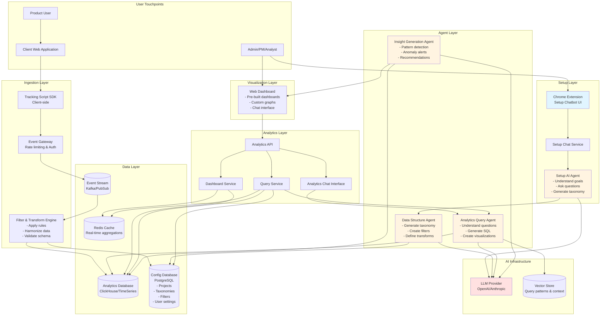
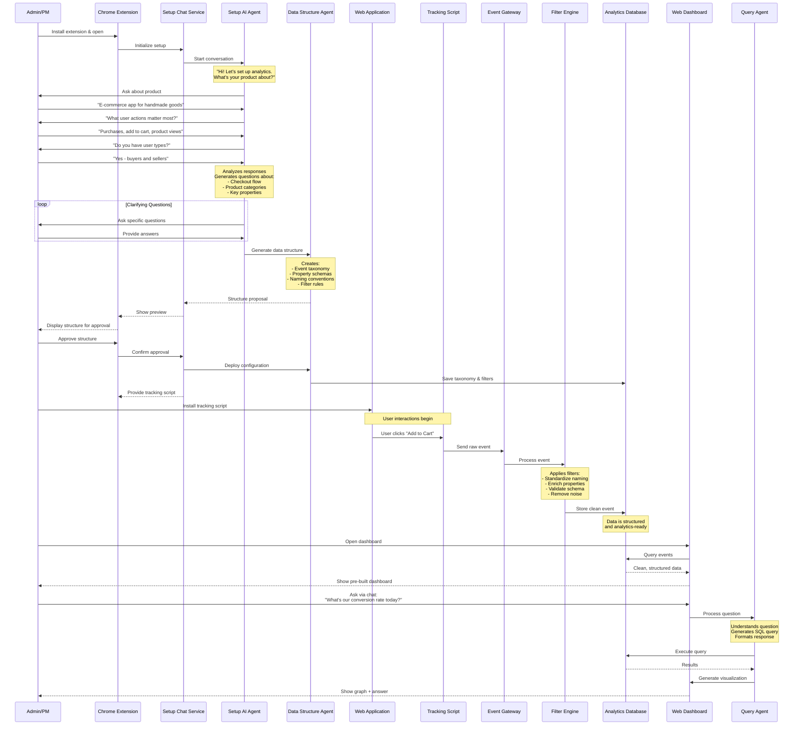
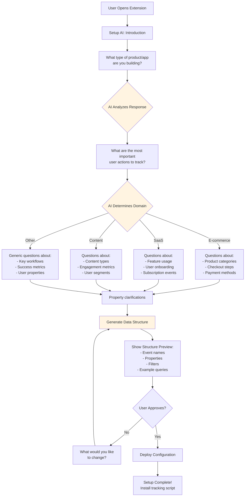
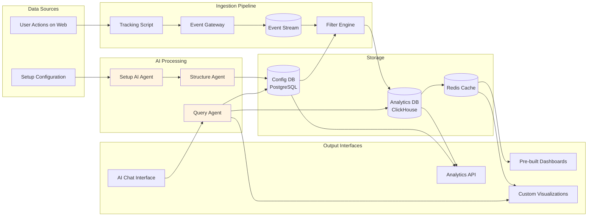

# Architecture Diagram - BetterHeap (MVP)

## Product Overview

### What is it?
An AI-powered web analytics platform that combines the ease of Heap's auto-tracking with intelligent data structuring through conversational AI. Unlike traditional analytics tools where data becomes messy and hard to query, BetterHeap uses an AI chatbot (via Chrome extension) to guide users through setup, understand their tracking needs, and automatically create clean, harmonized data structures that are ready to analyze.

### Business Value
**Problem**: Current web analytics tools like Heap and Mixpanel are either too complex to set up or produce messy, unstructured data. Heap auto-captures everything but the data becomes chaotic and hard to query. Mixpanel requires extensive manual setup and technical knowledge. Companies spend weeks configuring analytics, cleaning data, and still struggle to get meaningful insights because their event data is inconsistent.

**The Data Quality Gap**: Teams implement analytics quickly but realize months later that their data is unusable - inconsistent naming conventions, missing properties, duplicate events, and no clear taxonomy. This forces expensive data cleanup projects and rebuilding dashboards.

**Solution**: An analytics platform that combines automatic tracking with AI-guided data structuring. Our Chrome extension chatbot walks users through setup, understands their business goals, asks intelligent questions about what they want to track, and automatically creates a clean, harmonized data structure with filters and transformations applied at ingestion. The result: analytics-ready data from day one, with an AI assistant that helps query and visualize insights.

**Target Market**: Fast-growing startups and scale-ups (10-200 employees) who need powerful analytics but lack dedicated data engineers or extensive technical resources.

**Key Benefits**:
- **10-minute setup** - Chrome extension + conversational setup (vs. weeks of configuration)
- **Clean data from day one** - AI-structured taxonomy and automatic harmonization
- **No data engineering required** - filters and transformations handled automatically
- **Natural language queries** - ask questions, get insights without learning complex tools
- **Plug-and-play dashboards** - pre-built for common use cases
- **Cost-effective** - simpler infrastructure, faster time-to-value

### How It Works

1. **Install Chrome extension** and add tracking script to website
2. **Chat with Setup AI** - describe your product and what you want to track
3. **AI asks clarifying questions** about user flows, key actions, and business metrics
4. **System generates data structure** - event taxonomy, properties, naming conventions
5. **User approves structure** and AI configures filters/transformations
6. **Tracking begins** - script sends events, filters ensure clean data reaches database
7. **Analytics ready immediately** - pre-built dashboards populate automatically
8. **Chat with Analytics AI** for custom queries, graphs, and insights

### Core Innovation
Traditional analytics tools force you to choose: easy setup with messy data (Heap) or clean data with complex setup (Mixpanel). BetterHeap eliminates this tradeoff by using **AI-guided structuring at setup time** and **intelligent filtering at ingestion** to deliver both ease of use and data quality. Additionally, our **AI analytics assistant** makes querying data as simple as having a conversation.

---

## High-Level System Architecture



## MVP User Flow - Setup & First Insights



## Setup Conversation Flow



## Data Flow Architecture



## Technology Stack (MVP)

### Frontend
- **Chrome Extension**: React + TypeScript (Setup chatbot interface)
- **Web Dashboard**: Next.js + TypeScript (Analytics interface)
- **Tracking Script**: Vanilla JavaScript (Lightweight, < 10KB gzipped)
- **Charting**: Recharts or Chart.js (Visualization library)

### Backend Services
- **API Gateway**: Node.js + Express (or FastAPI)
- **Setup Chat Service**: Python + LangChain (Conversation management)
- **Analytics API**: Python + FastAPI (High-performance queries)
- **Filter Engine**: Python or Go (Real-time data transformation)

### AI/ML
- **LLM Provider**: OpenAI GPT-4 or Anthropic Claude (Setup & query agents)
- **Vector Database**: Pinecone or Weaviate (Query pattern matching)
- **Prompt Management**: LangChain or custom framework

### Data Infrastructure
- **Event Stream**: Kafka or Google Pub/Sub (Event ingestion)
- **Analytics Database**: ClickHouse (Fast time-series queries)
- **Config Database**: PostgreSQL (User settings, taxonomies, filters)
- **Cache**: Redis (Real-time aggregations)
- **Object Storage**: S3 (Raw event backup)

### Infrastructure
- **Cloud Platform**: AWS or GCP
- **Container Orchestration**: Docker + Kubernetes (or managed services)
- **Monitoring**: Prometheus + Grafana
- **Error Tracking**: Sentry

## MVP Feature Scope

### Phase 1: Core Setup & Tracking
- [ ] Chrome extension with conversational setup
- [ ] Setup AI agent (basic conversation flow)
- [ ] Data structure generation
- [ ] Tracking script SDK
- [ ] Event ingestion pipeline
- [ ] Basic filter engine
- [ ] PostgreSQL for configuration
- [ ] ClickHouse for analytics data

### Phase 2: Analytics & Visualization
- [ ] Web dashboard framework
- [ ] 3-5 pre-built dashboards (funnel, retention, engagement)
- [ ] Custom graph builder (line, bar, pie charts)
- [ ] Basic segmentation
- [ ] Date range filtering
- [ ] Export to CSV

### Phase 3: AI-Powered Insights
- [ ] Analytics chat interface
- [ ] Query generation agent
- [ ] Natural language to SQL
- [ ] Automatic visualization suggestions
- [ ] Basic anomaly detection
- [ ] Insight notifications

### Phase 4: Advanced Features (Post-MVP)
- [ ] Real-time event debugging
- [ ] A/B test analysis
- [ ] Cohort analysis
- [ ] Predictive analytics
- [ ] Data warehouse integrations
- [ ] Mobile SDK (iOS/Android)
- [ ] Team collaboration features

## Key Differentiators

| Feature | Heap | Mixpanel | BetterHeap |
|---------|------|----------|------------|
| **Setup Time** | 10 min (messy data) | Hours/days (manual) | 10 min (clean data) |
| **Data Quality** | Unstructured | Manual structuring | AI-structured |
| **Learning Curve** | Low (but messy) | High | Very low (AI-guided) |
| **Custom Queries** | Limited | Complex UI | Natural language chat |
| **Data Governance** | Weak | Manual | AI-enforced |
| **Price Point** | $$ | $$$ | $ |

## Success Metrics (MVP Goals)

**Setup Experience**:
- Average setup time: < 15 minutes
- Setup completion rate: > 85%
- User satisfaction with data structure: > 4.5/5

**Data Quality**:
- Event naming consistency: > 95%
- Schema validation pass rate: > 98%
- User-reported data issues: < 5%

**Analytics Usage**:
- Time to first insight: < 2 hours after installation
- Daily active users (of paying customers): > 60%
- AI chat queries per user per week: > 10

**Business Metrics**:
- Beta user acquisition: 50 companies in 3 months
- Conversion to paid: > 30%
- Customer satisfaction (NPS): > 50

---

## Future Vision

BetterHeap aims to become the **first truly conversational analytics platform** where setting up tracking and getting insights requires zero technical knowledge. Our long-term vision includes:

1. **Predictive Analytics**: AI proactively surfaces insights before you ask
2. **Cross-Platform Tracking**: Unified analytics across web, mobile, and backend
3. **Automated Experiments**: AI suggests and runs A/B tests automatically
4. **Data Warehouse Integration**: Sync with Snowflake, BigQuery for unified analytics
5. **Team Intelligence**: Learn from how your team queries data to improve suggestions
6. **Privacy-First**: Built-in compliance with GDPR, CCPA with AI-assisted configuration

## Getting Started

```bash
# Install dependencies
npm install

# Run development environment
docker-compose up -d

# Start frontend
cd frontend && npm run dev

# Start backend services
cd backend && python -m uvicorn main:app --reload

# Access:
# - Dashboard: http://localhost:3000
# - API Docs: http://localhost:8000/docs
```

## Contributing

This is currently in private development. Contact the team for collaboration opportunities.

## License

Proprietary - All rights reserved

